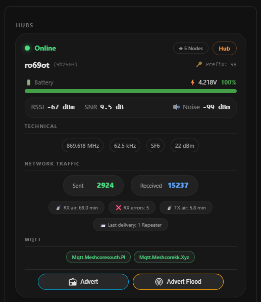
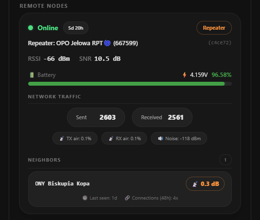

# MeshCore Card Enhanced!

Advanced Home Assistant Lovelace cards for the MeshCore mesh radio network, including full messaging support.

This project is based on the original MeshCore Card by John Pettitt and extends it with advanced messaging capabilities, improved user interaction, and enhanced Home Assistant integration.

Custom [Home Assistant](https://www.home-assistant.io/) Lovelace cards that display hub, node, contact, and channel statistics from the [MeshCore](https://meshcore.co.uk) mesh radio network integration.

[](https://github.com/dida886/meshcore-card/releases)
[](https://hacs.xyz)


[](https://github.com/dida886/meshcore-card)


[](https://my.home-assistant.io/redirect/hacs_repository/?owner=dida886&repository=meshcore-card&category=plugin)

---

## ☕ Support Development

If you find this project useful and would like to support future development:


[](https://www.buymeacoffee.com/dida886)

[](https://buycoffee.to/dida886)

Your support helps fund development, testing, bug fixes, and new features.

---

## 🌟 Enhanced Edition

While the original MeshCore Card focuses on monitoring MeshCore hubs, nodes, contacts, and channels, this Enhanced Edition transforms Home Assistant into a complete MeshCore communication dashboard.

### Key Enhancements

* Full MeshCore messaging support
* Message history viewer
* **NEW in 1.3.0: Transmission route visualization (RSSI, SNR, hop path)**
* **NEW in 1.3.0: Bubble-style message layout**
* URL detection and copy-to-clipboard
* Long-press message copying
* Mobile-friendly interaction model
* Improved user experience
* Additional translations
* Continuous community-driven development

---

## 📸 Screenshots

### Hub & Remote Nodes Card



### Message Card


### Contacts Card


### Channel Card


## 🚀 What's New in Version 1.3.0

### 🗺️ Transmission Route Visualization

The Message Card now displays full transmission metrics for received messages:

* **RSSI, SNR, and hop count** shown as a compact metrics bar below each message
* **Expandable path section** – click the metrics bar to reveal the complete transmission route (e.g., `a1b2 → c3d4 → e5f6 → ...`)
* **Smart path formatting** – automatically splits hex paths into readable node hops, with special handling for FLOOD and FOLD route types
* **SVG icons** for signal strength, activity, and waypoints – visually clean and theme-friendly

### 💬 Bubble-Style Message Layout

Messages now display in a modern chat-like bubble interface:

* **Sent messages** – right-aligned with green accent
* **Received messages** – left-aligned with blue accent
* Clear header with **time and sender name**
* Direction arrow icons integrated into the sender line

### 📡 Real-Time rx_log Data

The card now subscribes to `meshcore_message` events and reads transmission data from a local NDJSON file:

* Automatic refresh when new messages arrive
* Local file caching with automatic pruning (24h max age, 500 entries limit)
* Seamless integration – metrics appear automatically for messages with available route data

### 🔧 Configuration Required for Route Visualization

To enable the route visualization feature, you need to set up a file-based notification service that captures MeshCore events:

#### Step 1: Configure the File Notification Service

[](https://my.home-assistant.io/redirect/config_flow_start?domain=file)


Please configure **Set up a notification service**  and the file path set to  **/config/www/meshcore_rx.json**


**Note: If you are using default_config:, add allowlist_external_dirs under a separate homeassistant: key in your configuration.yaml. This allows the card to access /local/meshcore_rx.json.**

```yaml
default_config:
  whitelist_external_dirs:
    - '/config/www'
```

#### Step 2: Create the Automation

Create a new automation that writes every meshcore_message event to the file. The automation has been optimized in v1.3.1 to store only essential fields, reducing file size by ~50-60% compared to storing the full event data:

```yaml
alias: MeshCore - Log RX to file
description: ""
triggers:
  - event_type: meshcore_message
    trigger: event
actions:
  - data:
      entity_id: notify.file
      message: |
        
        
        {{ {"entity_id": d.entity_id, "sender_name": d.sender_name | default('unknown'), "rx_timestamp": rx.timestamp, "rssi": rx.rssi, "snr": rx.snr, "path": rx.path | default(''), "path_len": rx.path_len | default(0), "route_typename": rx.route_typename | default(''), "channel_name": rx.channel_name | default(''), "channel_idx": rx.channel_idx | default(0)} | tojson }}
    action: notify.send_message
mode: queued
```

What's optimized: Instead of storing the entire event JSON (~400-500 bytes per entry), the automation now extracts only the 10 essential fields needed for route visualization (~180-250 bytes per entry). Each entry is a clean, flat JSON object with no nested arrays – faster to parse and easier on disk space.

Note: The entity_id must match the notification entity created in Step 1. If you used a different name, adjust accordingly (e.g., notify.file).

### Step 3: Verify

Restart Home Assistant

Send or receive a message via MeshCore

Check that /config/www/meshcore_rx.json exists and contains JSON lines

The Message Card will automatically load and display route metrics for matching messages

### Optional: Automatic Log Rotation
The meshcore_rx.json file grows with every incoming message. To prevent it from becoming too large, you can set up automatic rotation that keeps only the most recent entries.

#### Step 1: Add a shell command
Add this to your configuration.yaml:

```yaml
shell_command:
  clean_rx_log: >
    lines=$(wc -l < /config/www/meshcore_rx.json) &&
    if [ "$lines" -gt 500 ]; then
      sed "1,$((lines-500))d" /config/www/meshcore_rx.json > /tmp/meshcore_rx_clean.json &&
      cp /tmp/meshcore_rx_clean.json /config/www/meshcore_rx.json;
    fi
```
This script:
- Counts the number of lines in the file
- Only runs when there are more than 500 entries
- Removes the oldest entries, keeping the 500 most recent
- Uses an atomic copy so the file is never inaccessible

#### Step 2: Create an automation

```yaml
alias: MeshCore - Clean old RX logs
description: ""
triggers:
  - trigger: time
    at: "03:00:00"
actions:
  - action: shell_command.clean_rx_log
    data: {}
```
This runs daily at 3:00 AM, keeping your log file lean and fast to load.

> **Note:** Adjust the **500** value to your needs. Each entry is roughly 100-125 bytes. Keep in mind that the Message Card loads this entire file into memory when displaying route metrics – a larger file means slower initial rendering and higher memory usage on the dashboard.

## 🚀 Previous Updates (Version 1.2.0)

### 🏗️ Enhanced Hub & Node Card

New Hub Parameters:

- Signal section: RSSI, SNR, Noise Floor

- Traffic section: Messages Sent, Messages Received

- Advanced statistics: Receive Errors, TX Queue Length, Last Message Delivery, TX Airtime, RX Airtime, Companion Prefix

Configurable Sections for Hub:
- Users can now hide/show individual sections via configuration:

- show_hub_technical – show/hide Technical section (Frequency, Bandwidth, SF, TX Power)

- show_hub_signal – show/hide Signal section (RSSI, SNR, Noise)

- show_hub_traffic – show/hide Traffic section (Sent/Received)

- show_hub_advanced – show/hide Advanced statistics

- show_hub_location – show/hide Location section

- show_hub_mqtt – show/hide MQTT section

Node Card Improvements:

- Temperature moved to header row (next to Repeater badge)

- Noise Floor moved to signal row (alongside RSSI/SNR)

- Responsive signal row – wraps on mobile devices (RSSI+SNR on one line, Noise below)

### 📇 Enhanced Contact Card

- Contact counter next to "CONTACTS" label – updates with filters

### 💬 Message Card Improvements

- Mention highlighting – `@[username]` appears with gold highlight

## Requirements

* Home Assistant 2023.x or later
* MeshCore Integration installed and configured

The cards read hub, node, contact, and channel information directly from entities created by the MeshCore integration.

---

## Installation

### HACS (Recommended)

1. Open **HACS → Frontend**

2. Select **Custom Repositories**

3. Add:

   https://github.com/dida886/meshcore-card

4. Category:

   Dashboard

5. Install **MeshCore Card Enhanced**

6. Reload your browser

---

### Manual Installation

1. Download the latest release:

   https://github.com/dida886/meshcore-card/releases

2. Copy:

   meshcore-card.js

   to:

   config/www/

3. Open:

   Settings → Dashboards → Resources

4. Add:

   /local/meshcore-card.js

   as a JavaScript Module.

5. Reload your browser.

---

# Cards

This package provides four card types.

---

## custom:meshcore-card

### Hub & Node Card

Displays all MeshCore hubs and their remote nodes automatically discovered from Home Assistant.

### Features

* Hub online/offline status
* Hardware model
* Firmware version
* Node count
* RF parameters
* MQTT broker status
* Hub location links
* Remote node discovery
* RSSI and SNR indicators
* Battery and voltage display
* Last seen timestamps
* Repeater statistics
* Optional sensor values
* Drag-and-drop node ordering
* Throttled rendering
* **Hub Sections** – Show/hide individual sections (Technical, Signal, Traffic, Advanced, Location, MQTT)
* **Hub Signal Metrics** – RSSI, SNR, Noise Floor
* **Hub Traffic Metrics** – Messages Sent, Messages Received
* **Hub Advanced Metrics** – Receive Errors, TX Queue Length, Last Message Delivery, TX Airtime, RX Airtime, Companion Prefix
* **Mobile-friendly signal row** – RSSI/SNR on one line, Noise below on small screens

### Configuration

```yaml
type: custom:meshcore-card

hubs:
  55733c:
    enabled: true
    battery_entity: sensor.x
    voltage_entity: sensor.x

nodes:
  MyNode:
    enabled: true
    battery_entity: sensor.x
    voltage_entity: sensor.x
    location_entity: sensor.x
    temperature_entity: sensor.x
    humidity_entity: sensor.x
    illuminance_entity: sensor.x
    pressure_entity: sensor.x

nodes_order:
  - MyNode
  - OtherNode

grid_options:
  rows: 4

# Hub section visibility (new in v1.2.0)
show_hub_technical: true
show_hub_signal: true
show_hub_traffic: true
show_hub_advanced: true
show_hub_location: true
show_hub_mqtt: true
```

### Shorthand

```yaml
hubs:
  55733c: true
  aabbcc: false

nodes:
  JPP: true
  YubaMonitor: false
```

---

## custom:meshcore-message-card

### Message Card

Send and receive MeshCore messages directly from Home Assistant.

### Features

* Send messages to channels
* Send messages to contacts
* View message history
* Automatic refresh after sending
* URL detection
* URL copy support
* Long-press message copy
* Mobile and desktop support
* Multi-language support
* Status notifications
* Manual refresh button
* NEW: Default channel selection

### Configuration
The Message Card automatically discovers all available channels and contacts. You can optionally set a default channel to load automatically when the card starts.

```yaml
type: custom:meshcore-message-card
```
Default Channel Configuration
Specify a default channel using the default_channel parameter. This can be either:

Numeric channel index (e.g., 0, 1, 2, ...)

Channel name (e.g., "public", "private", ...)

Examples:

```yaml
# Load channel 0 (public channel) by default
type: custom:meshcore-message-card
default_channel: 0
```

```yaml
# Load channel by name
type: custom:meshcore-message-card
default_channel: "public"
```
```yaml
# Load channel 2 by index
type: custom:meshcore-message-card
default_channel: 2
```
Note: If the specified channel does not exist in the system, the card will show the default "Select channel" prompt. The user can always manually change the channel selection from the dropdown list.

Example Dashboard Configuration
```yaml
views:
  - title: MeshCore
    cards:
      - type: custom:meshcore-message-card
        default_channel: 0
```

---

## custom:meshcore-contact-card

### Contact Card

Displays discovered MeshCore contacts with advanced filtering and contact management capabilities.

* **State filtering** – filter contacts by their current state:
  - `all` – show all contacts
  - `discovered` – show only discovered devices (not added to your node)
  - `fresh` – show only active contacts (seen within last 12 hours)
  - `stale` – show only inactive contacts (not seen for over 12 hours)

* **Type filtering** – filter contacts by device type:
  - `all` – show all types
  - `repeater` – show only repeaters
  - `room` – show only room servers
  - `sensor` – show only sensors
  - `client` – show only client devices

* **Quick contact management** – add or remove contacts directly from the card:
  - Green `+` button appears next to discovered contacts – click to add to your node
  - Red `-` button appears next to fresh/stale contacts – click to remove from your node
  - Instant visual feedback – button toggles immediately after clicking
  - Auto-refresh – list updates automatically after successful operation

### Features

* Sort by most recent advertisement
* Online/offline indicators with glow animation
* Contact icons and pictures
* Location links to map view
* Age filtering (max_contact_age_days)
* Grid-aware clipping for dashboard layouts
* Instant add/remove contacts with visual feedback
* State and type filtering with dropdown selectors
* Human-readable timestamps (seconds, minutes, hours, days ago)

### Configuration

```yaml
type: custom:meshcore-contact-card

# Maximum age of contacts to display (default: 7 days)
max_contact_age_days: 7

# Filter by contact state (default: all)
contact_filter: all

# Filter by device type (default: all)
node_type_filter: all

# Grid layout options
grid_options:
  rows: 4
```


---

## custom:meshcore-channel-card

### Channel Card

Displays active MeshCore message channels.

### Features

* Channel list
* Active status indicator
* Hub association
* Channel names
* Grid-aware clipping

### Configuration

```yaml
type: custom:meshcore-channel-card

grid_options:
  rows: 4
```

---

## Localization

Supported languages:

* English
* French
* Dutch
* German
* Polish

The active Home Assistant language is detected automatically.

---

## Contributing

Contributions are welcome.

If you discover a bug, have a feature request, or would like to improve translations, please open an issue or submit a pull request.

---

## License

MIT

Copyright (c) 2026 John Pettitt

Additional enhancements and Message Card functionality:

Copyright (c) 2026 Damian Mainka

---

## Authors

Original Project

John Pettitt

Enhanced Edition

Damian Mainka
