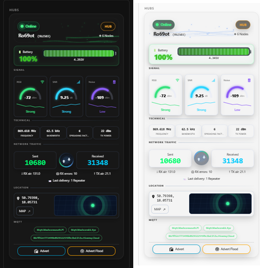
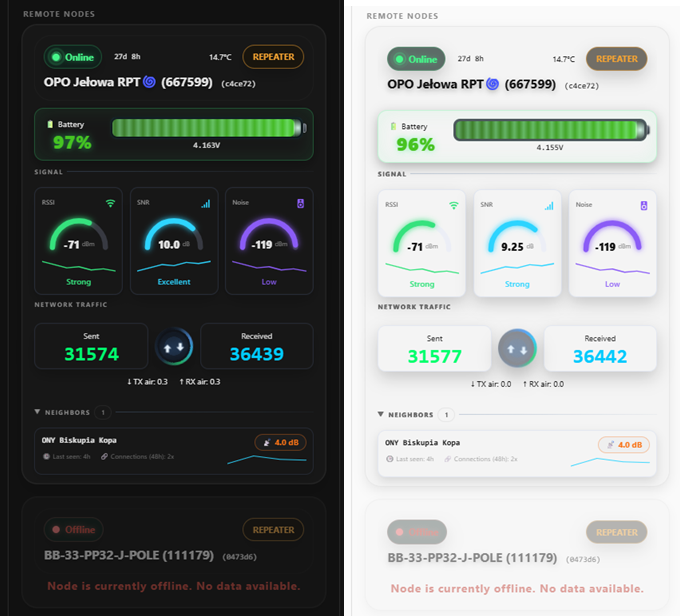
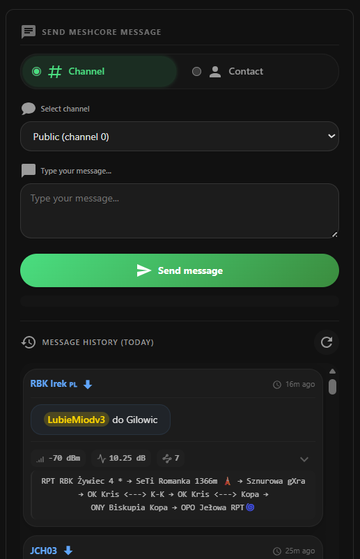
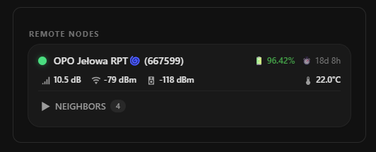
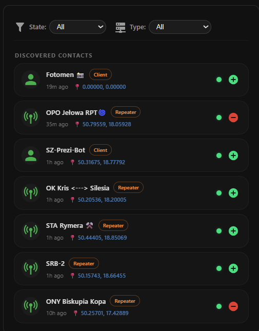
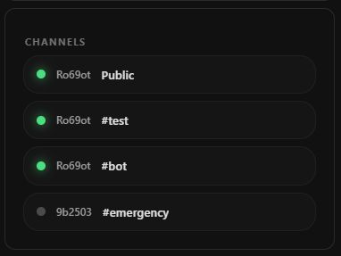
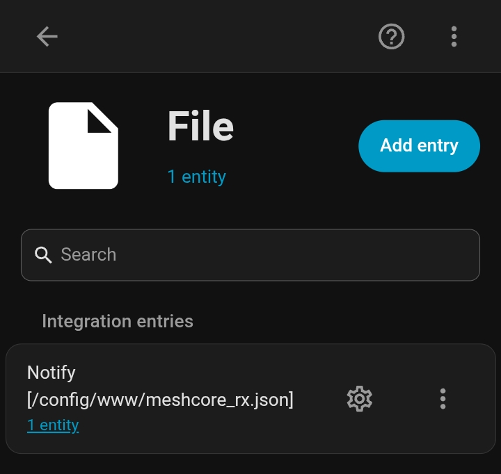

# MeshCore Card Enhanced!

Advanced Home Assistant Lovelace cards for the MeshCore mesh radio network, including full messaging support.

This project is based on the original MeshCore Card by John Pettitt and extends it with advanced messaging capabilities, improved user interaction, and enhanced Home Assistant integration.

Custom [Home Assistant](https://www.home-assistant.io/) Lovelace cards that display hub, node, contact, and channel statistics from the [MeshCore](https://meshcore.co.uk) mesh radio network integration.

[](https://github.com/dida886/meshcore-card/releases)
[](https://hacs.xyz)


[](https://github.com/dida886/meshcore-card)


[](https://my.home-assistant.io/redirect/hacs_repository/?owner=dida886&repository=meshcore-card&category=plugin)

---

## ☕ Support Development

If you find this project useful and would like to support future development:


[](https://www.buymeacoffee.com/dida886)

[](https://buycoffee.to/dida886)

Your support helps fund development, testing, bug fixes, and new features.

---
## 🎉 What's New in 1.5.0

- **Complete UI Overhaul** – All cards have been redesigned with a unified, modern look. Shared components are now extracted into a common base, reducing code duplication and improving performance.
- **Dynamic Theming** – Hub card particles now automatically adapt to your Home Assistant theme (light/dark) for a seamless visual experience.
- **Signal Icons** – Each signal card (RSSI, SNR, Noise) now displays an icon with matching color, improving at-a-glance readability.
- **Expandable Neighbors in Node Card** – Neighbors can now be expanded/collapsed, just like in the Quick Repeater card. Use `neighbors_expanded_default` to control the default state.
- **Offline Status Pill** – The Node card now clearly distinguishes offline nodes with a dedicated offline pill (red background).
- **Improved Quick Repeater Card** – Offline repeaters now show a clear "Node Offline" message, just like the Node card.
- **Better Maintainability** – The entire codebase has been refactored, making future enhancements easier and faster.


## 🌟 Enhanced Edition

While the original MeshCore Card focuses on monitoring MeshCore hubs, nodes, contacts, and channels, this Enhanced Edition transforms Home Assistant into a complete MeshCore communication dashboard.

### Key Enhancements

- Full MeshCore messaging support
- Message history viewer
- **Transmission route visualization (RSSI, SNR, hop path)**
- **Bubble-style message layout**
- **Display repeater names in path** – optionally show friendly names instead of hex IDs
- **Advert buttons on Hub card** – send Advert/Advert Flood with one click
- **Quick Repeater Card** – dedicated dashboard for monitoring all repeaters at a glance
- URL detection and copy-to-clipboard
- Long-press message copying
- Mobile-friendly interaction model
- Multi-language support (EN, FR, NL, DE, PL, RU)
- **New in 1.5.0: Dynamic theme-aware particles, signal icons, expandable neighbors**

---

## 📸 Screenshots

### Hub Card
```yaml
custom:meshcore-hub-card
```


### Remote Nodes Card
```yaml
custom:meshcore-node-card
```


### Message Card
```yaml
custom:meshcore-message-card
```


### Quick Repeater Card
```yaml
type: custom:meshcore-quick-repeater-card
```


### Contacts Card
```yaml
custom:meshcore-contact-card
```


### Channel Card
```yaml
custom:meshcore-channel-card
```



## 📡 Real-Time rx_log Data in Message Card

The Message Card reads transmission data from a local NDJSON file (`/local/meshcore_rx.json`) and subscribes to `meshcore_message` events for live updates:

* **Automatic refresh** – the card reloads transmission data whenever a new `meshcore_message` event is received
* **File-based caching** – transmission metrics (RSSI, SNR, path, hop count) are stored locally for historical messages
* **Seamless integration** – route metrics appear automatically for messages with available path data

> **Note:** The card reads from the file but does not manage the file itself. You need to configure a file notification service and an automation to populate and maintain the file. See below.

### 🔧 Configuration Required for Route Visualization

To enable the route visualization feature, you need to set up a file-based notification service that captures MeshCore events:

#### Step 1: Configure the File Notification Service

[](https://my.home-assistant.io/redirect/config_flow_start?domain=file)



Please configure **Set up a notification service**  and the file path set to  **/config/www/meshcore_rx.json**


**Note: If you are using default_config:, add allowlist_external_dirs under a separate homeassistant: key in your configuration.yaml. This allows the card to access /local/meshcore_rx.json.**

```yaml
default_config:
  whitelist_external_dirs:
    - '/config/www'
```

#### Step 2: Create the Automation

Create a new automation that writes every meshcore_message event to the file. The automation has been optimized in v1.3.1 to store only essential fields, reducing file size by ~50-60% compared to storing the full event data:

```yaml
alias: MeshCore - Log RX to file
description: ""
triggers:
  - event_type: meshcore_message
    trigger: event
actions:
  - data:
      entity_id: notify.file
      message: |
        
        
        {{ {"entity_id": d.entity_id, "sender_name": d.sender_name | default('unknown'), "rx_timestamp": rx.timestamp, "rssi": rx.rssi, "snr": rx.snr, "path": rx.path | default(''), "path_len": rx.path_len | default(0), "route_typename": rx.route_typename | default(''), "channel_name": rx.channel_name | default(''), "channel_idx": rx.channel_idx | default(0)} | tojson }}
    action: notify.send_message
mode: queued
```

What's optimized: Instead of storing the entire event JSON (~400-500 bytes per entry), the automation now extracts only the 10 essential fields needed for route visualization (~180-250 bytes per entry). Each entry is a clean, flat JSON object with no nested arrays – faster to parse and easier on disk space.

Note: The entity_id must match the notification entity created in Step 1. If you used a different name, adjust accordingly (e.g., notify.file).

### Step 3: Verify

Restart Home Assistant

Send or receive a message via MeshCore

Check that /config/www/meshcore_rx.json exists and contains JSON lines

The Message Card will automatically load and display route metrics for matching messages

### Optional: Automatic Log Rotation
The meshcore_rx.json file grows with every incoming message. To prevent it from becoming too large, you can set up automatic rotation that keeps only the most recent entries.

#### Step 1: Add a shell command
Add this to your configuration.yaml:

```yaml
shell_command:
  clean_rx_log: >
    lines=$(wc -l < /config/www/meshcore_rx.json) &&
    if [ "$lines" -gt 500 ]; then
      sed "1,$((lines-500))d" /config/www/meshcore_rx.json > /tmp/meshcore_rx_clean.json &&
      cp /tmp/meshcore_rx_clean.json /config/www/meshcore_rx.json;
    fi
```
This script:
- Counts the number of lines in the file
- Only runs when there are more than 500 entries
- Removes the oldest entries, keeping the 500 most recent
- Uses an atomic copy so the file is never inaccessible

#### Step 2: Create an automation

```yaml
alias: MeshCore - Clean old RX logs
description: ""
triggers:
  - trigger: time
    at: "03:00:00"
actions:
  - action: shell_command.clean_rx_log
    data: {}
```
This runs daily at 3:00 AM, keeping your log file lean and fast to load.

> **Note:** Adjust the **500** value to your needs. Each entry is roughly 100-125 bytes. Keep in mind that the Message Card loads this entire file into memory when displaying route metrics – a larger file means slower initial rendering and higher memory usage on the dashboard.


## Requirements

* Home Assistant 2023.x or later
* MeshCore Integration installed and configured

The cards read hub, node, contact, and channel information directly from entities created by the MeshCore integration.

---

## Installation

### HACS (Recommended)

1. Open **HACS → Frontend**

2. Select **Custom Repositories**

3. Add:

   https://github.com/dida886/meshcore-card

4. Category:

   Dashboard

5. Install **MeshCore Card Enhanced**

6. Reload your browser

---

### Manual Installation

1. Download the latest release:

   https://github.com/dida886/meshcore-card/releases

2. Copy:

   meshcore-card.js

   to:

   config/www/

3. Open:

   Settings → Dashboards → Resources

4. Add:

   /local/meshcore-card.js

   as a JavaScript Module.

5. Reload your browser.

---

# Cards

This package provides six card types.

---

## custom:meshcore-card / custom:meshcore-hub-card

### Hub Card

> **Note:** `custom:meshcore-card` is kept for backward compatibility and now works identically to `custom:meshcore-hub-card` – both display only MeshCore hubs. For new setups, we recommend using `custom:meshcore-hub-card`.

Displays all MeshCore hubs automatically discovered from Home Assistant. Nodes are no longer displayed here – use the dedicated `custom:meshcore-node-card` for nodes.

### Features

* Hub online/offline status
* Hardware model
* Firmware version
* Node count
* RF parameters
* MQTT broker status
* Hub location links
* RSSI and SNR indicators
* Battery and voltage display
* **Hub Sections** – Show/hide individual sections (Technical, Signal, Traffic, Advanced, Location, MQTT)
* **Hub Signal Metrics** – RSSI, SNR, Noise Floor
* **Hub Traffic Metrics** – Messages Sent, Messages Received
* **Hub Advanced Metrics** – Receive Errors, TX Queue Length, Last Message Delivery, TX Airtime, RX Airtime, Companion Prefix
* **Mobile-friendly signal row** – RSSI/SNR on one line, Noise below on small screens
* **Advert Buttons** – send Advert/Advert Flood directly from hub card

### Configuration

Both card types use the same configuration:

```yaml
# Option 1: Legacy card (kept for compatibility)
type: custom:meshcore-card

# Option 2: New dedicated hub card (recommended)
type: custom:meshcore-hub-card

hubs:
  55733c:
    enabled: true

grid_options:
  rows: 4

# Hub section visibility
show_hub_technical: true
show_hub_signal: true
show_hub_traffic: true
show_hub_location: true
show_hub_mqtt: true
show_hub_advert_buttons: true
disabled_animations: false,
```
---

## custom:meshcore-node-card

### Node Card

A dedicated card for monitoring all MeshCore nodes (repeaters, rooms, sensors, clients) with powerful filtering and visibility controls.

### Features

- **Complete node overview** – displays all nodes in a compact, scannable list
- **Key metrics at a glance** – battery percentage, uptime, SNR, RSSI, noise floor, and temperature
- **Filter by node type** – show only specific node types:
  - `all` – all nodes
  - `repeater` – only repeaters
  - `room` – only room servers
  - `sensor` – only sensors
  - `client` – only client devices
- **Hide individual nodes** – easily toggle visibility of specific nodes via checkbox list in the editor
- **Expandable neighbor list** – click the "Neighbors" header to reveal detailed information about each neighbor:
  - Neighbor name (with clickable link to contact details)
  - SNR value with color coding (green/yellow/orange/red)
  - Time since last seen
  - Connection count over the last 48 hours
- **Mobile-first design** – optimized for small screens with large touch targets
- **Zero configuration required** – just add the card and it works automatically
- **Click-through** – click on any metric to open the more-info dialog for that entity

**Perfect for monitoring your entire MeshCore network** – see which devices are online, which have weak signals, and which need attention, all from a single card.

### Configuration

```yaml
type: custom:meshcore-node-card

# Optional: Filter by node type
node_type_filter: all  # Options: all, repeater, room, sensor, client
# Expand neighbor lists by default (optional, default: true)
neighbors_expanded_default: true

# Optional: Hide specific nodes (can also be configured via editor checkboxes)
hidden_nodes:
  - "MeshCore Repeater: OPO Jełowa RPT🌀 (667599)"
  - "MeshCore Repeater: BB-33-PP32-J-POLE (111179)"

# Optional: Grid rows for dashboard layout
grid_options:
  rows: 4
```
The card automatically discovers all nodes in your MeshCore network and displays them with all available metrics. The editor provides an intuitive checkbox interface for hiding individual nodes.


## custom:meshcore-quick-repeater-card

### Quick Repeater Card

Displays all MeshCore repeaters in a compact, scannable list with key metrics and expandable neighbor details.

Features:
* Repeater overview – list all repeaters with online/offline status
* Key metrics – battery percentage, uptime, SNR, RSSI, noise floor, temperature
* Expandable neighbors – click "Neighbors" header to reveal detailed neighbor information:
* Neighbor name (clickable → more-info)
* SNR with color coding
* Time since last seen
* Connection count (48h)
* Smart sorting – sort by SNR (best first), name, or battery level
* Mobile-first – optimized for small screens with large touch targets
* Zero configuration – just add the card and it works
* Click-through – all metrics are clickable and open more-info dialog

Configuration
```yaml
type: custom:meshcore-quick-repeater-card
# Optional: Sort order
sort_by: snr  # Options: snr (default), name, battery
# Optional: Grid rows for dashboard layout
grid_options:
  rows: 4
 ``` 
The card automatically discovers all repeaters in your MeshCore network – no manual configuration required.


## custom:meshcore-message-card

### Message Card

Send and receive MeshCore messages directly from Home Assistant.

### Features

* Send messages to channels
* Send messages to contacts
* View message history
* Automatic refresh after sending
* URL detection and copy support
* Long-press message copy
* **Sender mention** – click on a received message sender to automatically insert `@[sender]` into the input field
* **Mention highlighting** – `@[username]` appears with gold highlight for easy recognition
* Mobile and desktop support
* Multi-language support
* Status notifications
* Manual refresh button
* Default channel selection
* Route visualization with RSSI/SNR metrics
* Repeater name mapping in paths

### Configuration
The Message Card automatically discovers all available channels and contacts. You can optionally set a default channel to load automatically when the card starts.

```yaml
type: custom:meshcore-message-card
```
Default Channel Configuration
Specify a default channel using the default_channel parameter. This can be either:

Numeric channel index (e.g., 0, 1, 2, ...)

Channel name (e.g., "public", "private", ...)

Examples:

```yaml
# Load channel 0 (public channel) by default
type: custom:meshcore-message-card
default_channel: 0
```

```yaml
# Load channel by name
type: custom:meshcore-message-card
default_channel: "public"
```
```yaml
# Load channel 2 by index
type: custom:meshcore-message-card
default_channel: 2
```
Note: If the specified channel does not exist in the system, the card will show the default "Select channel" prompt. The user can always manually change the channel selection from the dropdown list.

Example Dashboard Configuration
```yaml
views:
  - title: MeshCore
    cards:
      - type: custom:meshcore-message-card
        default_channel: 0
```
### Route Visualization with Repeater Names

You can replace the raw hexadecimal identifiers in the transmission path with human-readable repeater names:

- **use_repeater_names** (optional, default: `true`) – when enabled, the path will display discovered contact names instead of hex values. Unrecognized nodes are shown as "Unknown (hex)".

```yaml
# Enable/disable repeater names in path
type: custom:meshcore-message-card
use_repeater_names: true
```

When enabled, a path like 08d1 → f8db → 1515 → 01e6 → 5261 → 6675 will be displayed as RPT RBK Żywiec 4* → RPT RBK Żywiec 2+ → Szyndzielnia RPT 🚡 → Kapliczka → ONY Biskupia Kopa → OPO Jełowa RPT🌀

---


## custom:meshcore-contact-card

### Contact Card

Displays discovered MeshCore contacts with advanced filtering and contact management capabilities.

* **State filtering** – filter contacts by their current state:
  - `all` – show all contacts
  - `discovered` – show only discovered devices (not added to your node)
  - `fresh` – show only active contacts (seen within last 12 hours)
  - `stale` – show only inactive contacts (not seen for over 12 hours)

* **Type filtering** – filter contacts by device type:
  - `all` – show all types
  - `repeater` – show only repeaters
  - `room` – show only room servers
  - `sensor` – show only sensors
  - `client` – show only client devices

* **Quick contact management** – add or remove contacts directly from the card:
  - Green `+` button appears next to discovered contacts – click to add to your node
  - Red `-` button appears next to fresh/stale contacts – click to remove from your node
  - Instant visual feedback – button toggles immediately after clicking
  - Auto-refresh – list updates automatically after successful operation

### Features

* Sort by most recent advertisement
* Online/offline indicators with glow animation
* Contact icons and pictures
* Location links to map view
* Age filtering (max_contact_age_days)
* Grid-aware clipping for dashboard layouts
* Instant add/remove contacts with visual feedback
* State and type filtering with dropdown selectors
* Human-readable timestamps (seconds, minutes, hours, days ago)

### Configuration

```yaml
type: custom:meshcore-contact-card

# Maximum age of contacts to display (default: 7 days)
max_contact_age_days: 7

# Filter by contact state (default: all)
contact_filter: all

# Filter by device type (default: all)
node_type_filter: all

# Grid layout options
grid_options:
  rows: 4
```


---

## custom:meshcore-channel-card

### Channel Card

Displays active MeshCore message channels.

### Features

* Channel list
* Active status indicator
* Hub association
* Channel names
* Grid-aware clipping

### Configuration

```yaml
type: custom:meshcore-channel-card

grid_options:
  rows: 4
```

---

## Localization

Supported languages:

* English
* French
* Dutch
* German
* Polish
* Russian

The active Home Assistant language is detected automatically.

---

## Contributing

Contributions are welcome.

If you discover a bug, have a feature request, or would like to improve translations, please open an issue or submit a pull request.

---

## License

MIT

Copyright (c) 2026 John Pettitt

Additional cards, enhancements, and continuous development:

Copyright (c) 2026 Damian Mainka

---

## Authors

Original Project

John Pettitt

Enhanced Edition

Damian Mainka
